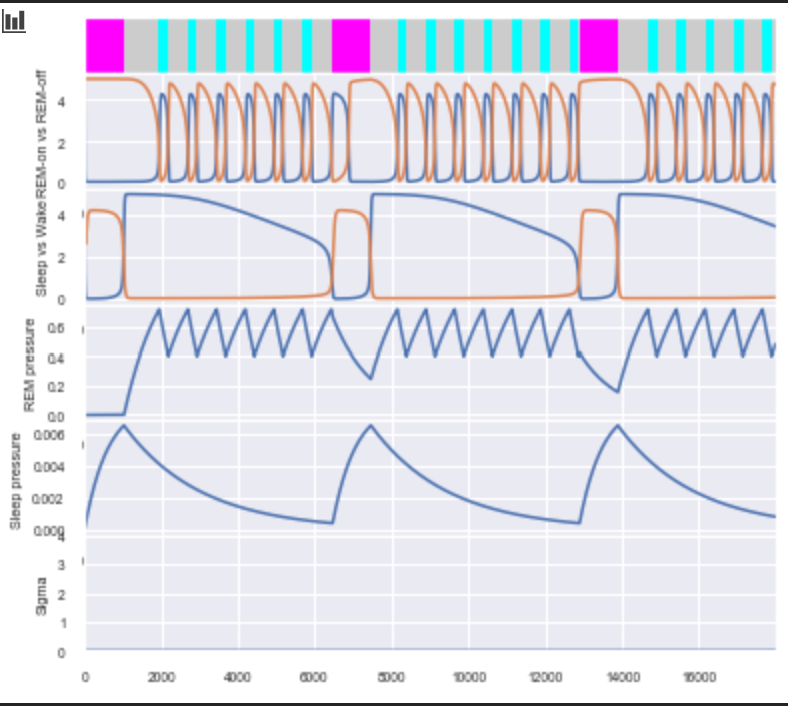
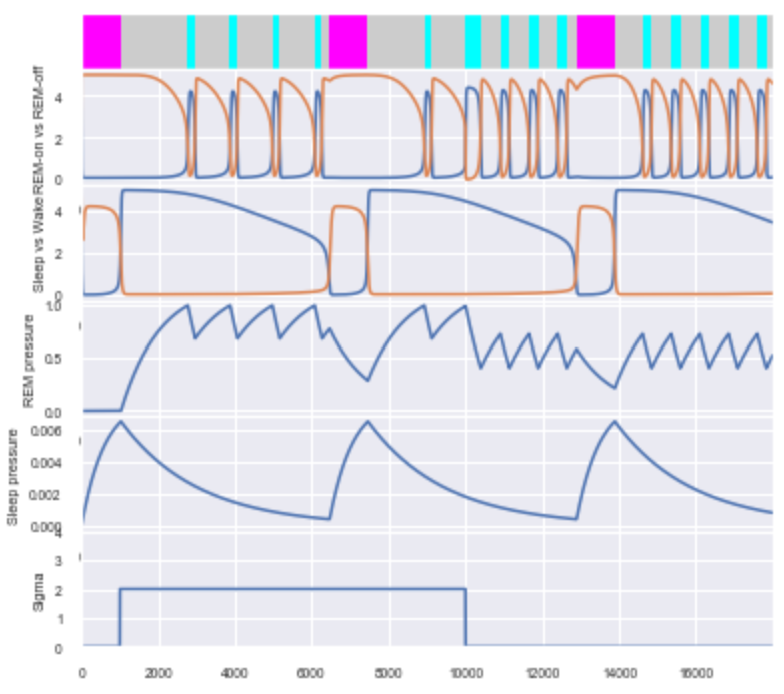
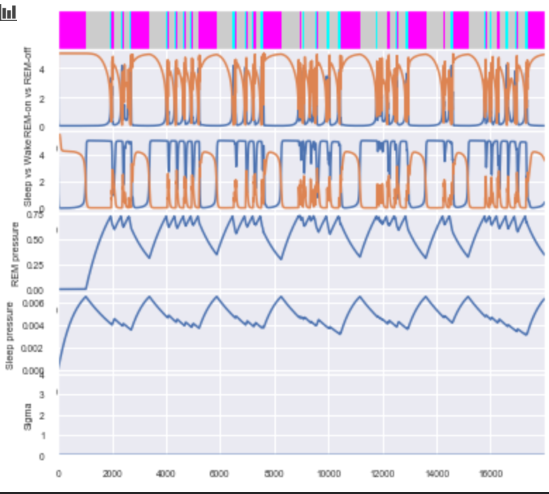
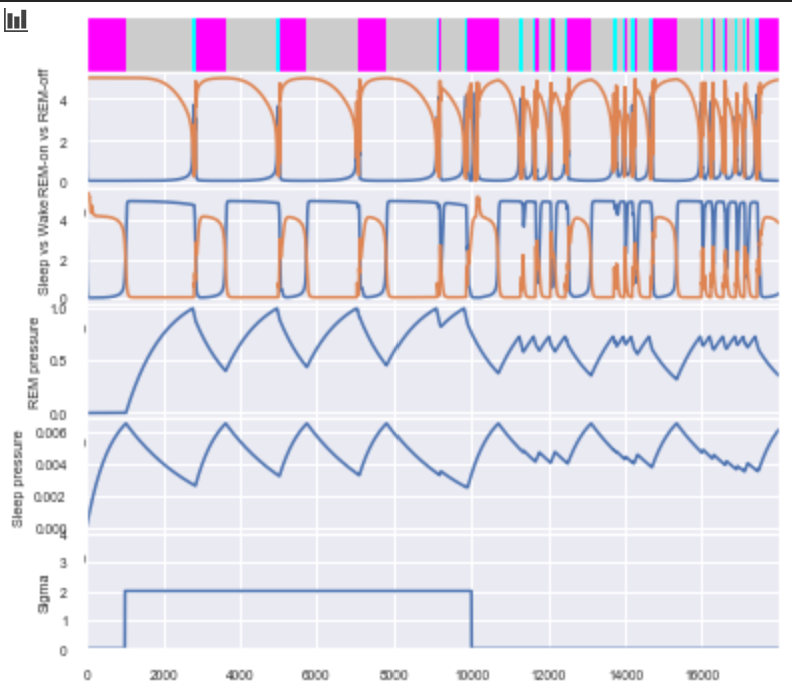

# Mouse-Sleep-Models-with-Periods-of-Optogenetic-Activation
Modification of the mathematical model surrounding the sleep dynamics of mice described in "Coupled Flip-Flop Model for REM Sleep Regulation in the Rat" by accounting for changes in sleep patterns due to optogenetic stimulation of a desired brain region.

# Images

\nExample hypnogram of mouse sleep states over a 5 hour period predicted by the mathematical model used (no optogenetic activation). Purple blocks, gray, and blue blocks represent wake, non-REM, and REM states respectively. Firing rates of REM-on vs. REM-off and Wake vs. Sleep populations, REM and sleep pressures, and the applied optogenetic activation peiod are included under the hypnogram (there is not activation period in this figure).

\nExample hypnogram of mouse sleep states over a 5 hour period with a period of optogenetic activation of a REM-off population (suppressing REM). Activation period is shown in the bottom subplot of the figure.

\nExample hypnogram of mouse sleep states over a 5 hour period with added noise and no optogenetic activation

\nExample hypnogram of mouse sleep states over a 5 hour period with added noise and a period of optogenetic activation of a REM-off population (suppressing REM).
